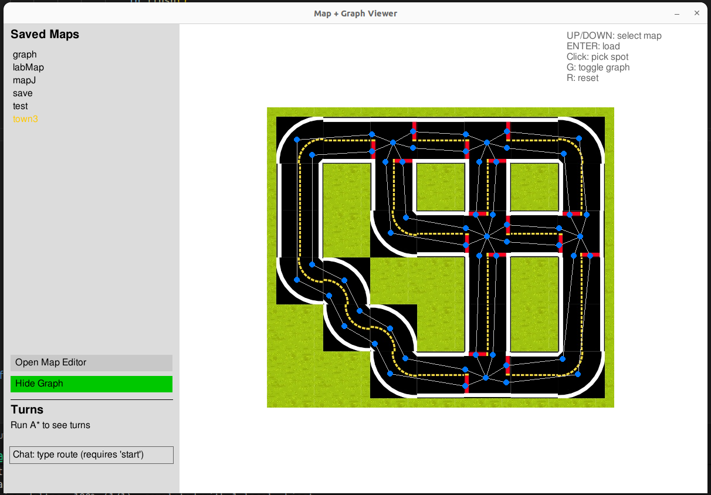
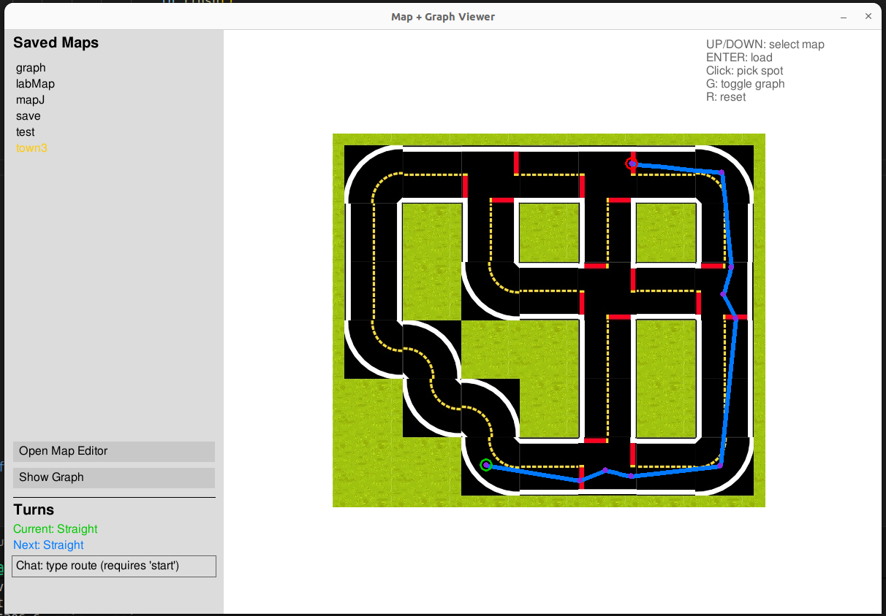
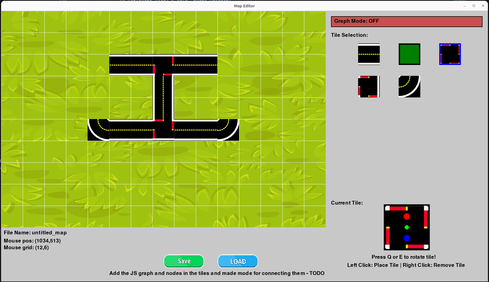
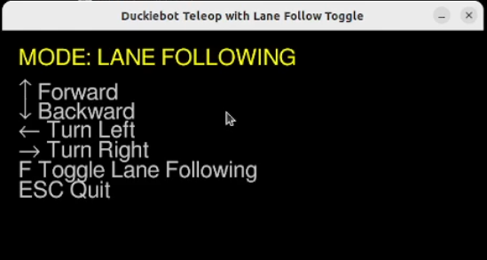
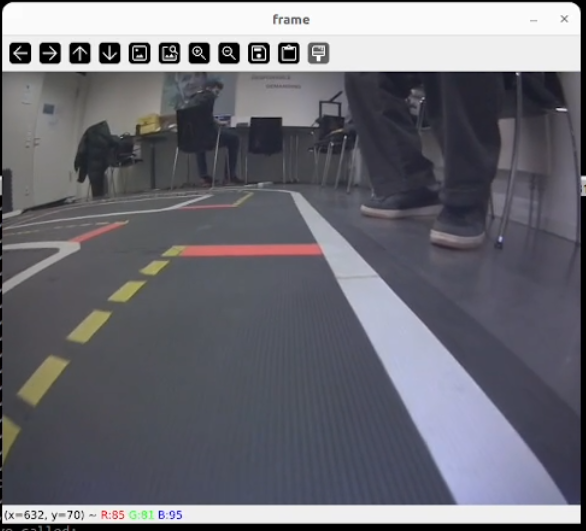

# Duckietown Self-Navigation Toolkit

This repository is a practical toolkit for Duckiebot navigation workflows.
The main focus is self-navigation through map/graph-based routing and turn-stream output (`turns.bin`), with teleoperation, lane-follow/rescue tests, and calibration tools included for full robot operation.

## Screenshots

Main self-navigation UI:



Generated path and turn workflow:



Map editor:



Teleoperation movement UI:



Camera connectivity/test view:



## What This Repo Contains

- Self-navigation tooling:
  - Interactive map + graph route UI in `main.py`
  - A* visualizer/test harness in `utils/graph/AStarTest.py`
  - Route text parsing and binary turn-file writing in `llm/route_instructions.py`
- Robot control and runtime utilities:
  - `duckie_teleop_gui.py`
  - `testing/test_stop_lanefollow.py`
  - `run_both_async.py` to launch concurrent runtime processes
- Calibration and camera tools:
  - `duckie_camera_gui.py`, `test_camera.py`
  - `calibrate_intrinsics.py`, `calibrate_extrinsics.py`
- Map editing and assets:
  - `mapeditor/`
  - `graph_drawer/`

## Quick Start

### 1. Install dependencies

```bash
pip3 install pygame numpy opencv-python websockets requests
```

### 2. Run the self-navigation UI

```bash
python3 main.py
```

### 3. Basic route flow in `main.py`

1. Load a saved graph from the left panel.
2. Click a start node and an end node.
3. A* runs and generates a path.
4. Turn decisions are streamed to `turns.bin` as raw bytes.

Turn encoding:
- `0` = right
- `1` = straight
- `2` = left
- `3` = u-turn

## Concurrent Runtime (Main + Teleop + Lane-Follow Test)

Use this when you want the full runtime stack together:

```bash
python3 run_both_async.py <bot_name>
```

Example:

```bash
python3 run_both_async.py entebot208
```

This starts:
- `main.py`
- `duckie_teleop_gui.py`
- `testing/test_stop_lanefollow.py`

If one process exits, the runner stops the others.

## Navigation and A* Development Tools

- Main app:
  - `python3 main.py`
- A* visualizer/test app:
  - `python3 -m utils.graph.AStarTest`
- Route text to binary turns:
  - `python3 -m llm.route_instructions "go straight then left then right"`

The route writer stores turns in `turns.bin` in binary format.

## Teleoperation and Rescue-Oriented Utilities

- Teleop GUI:
  - `python3 duckie_teleop_gui.py <bot_name>`
- Stop/lane-follow test:
  - `python3 testing/test_stop_lanefollow.py <bot_name>`
- Movement calibration teleop:
  - `python3 duckie_move_calib.py <bot_name>`

## Camera and Calibration

- Camera connectivity check:
  - `python3 test_camera.py <bot_name>`
- Camera capture GUI:
  - `python3 duckie_camera_gui.py <bot_name>`
- Intrinsics:
  - `python3 calibrate_intrinsics.py`
- Extrinsics:
  - `python3 calibrate_extrinsics.py`

Calibration outputs are stored under:
- `camera_intrinsic/`
- `camera_extrinsic/`
- `calibration/` (captured images)

## Project Layout

- `main.py`: Primary self-navigation UI and A* execution flow
- `utils/graph/`: Graph classes and A* test visualizer
- `llm/`: Route parsing and turn serialization
- `testing/`: Runtime tests and turn readers
- `mapeditor/`: Graph/map editing tools and saved maps
- `run_both_async.py`: Process runner for concurrent workflows

## Notes

- This codebase is actively evolving; prefer this README and in-file docstrings over older standalone docs.
- Use Python 3 (`python3`) for all commands.
